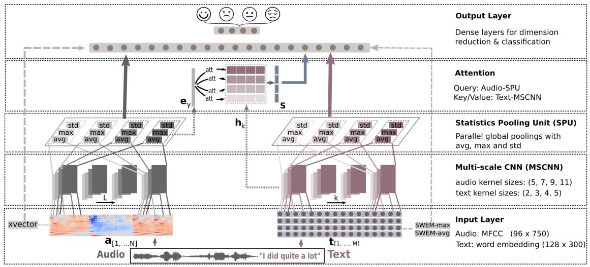

# icassp2021-mscnn-spu
Code for paper "[Efficient Speech Emotion Recognition Using Multi-Scale CNN and Attention](https://ieeexplore.ieee.org/document/9414286)" (ICASSP 2021)  

Multimodal, single modal models are being reformatted and will be updated soon.   


-----  


## Abstraction 
Emotion recognition from speech is a challenging task. Re-
cent advances in deep learning have led bi-directional recur-
rent neural network (Bi-RNN) and attention mechanism as a
standard method for speech emotion recognition, extracting
and attending multi-modal features - audio and text, and then
fusing them for downstream emotion classification tasks. In
this paper, we propose a simple yet efficient neural network
architecture to exploit both acoustic and lexical information
from speech. The proposed framework using multi-scale con-
volutional layers (MSCNN) to obtain both audio and text hid-
den representations. Then, a statistical pooling unit (SPU)
is used to further extract the features in each modality. Be-
sides, an attention module can be built on top of the MSCNN-
SPU (audio) and MSCNN (text) to further improve the perfor-
mance. Extensive experiments show that the proposed model
outperforms previous state-of-the-art methods on IEMOCAP
dataset with four emotion categories (i.e., angry, happy, sad
and neutral) in both weighted accuracy (WA) and unweighted
accuracy (UA), with an improvement of 5.0% and 5.2% re-
spectively under the ASR setting.  

----  


## Model  


## How to use 
Comming soon.. 


## Cite Us 

```latex
@INPROCEEDINGS{9414286,  
	author={Peng, Zixuan and Lu, Yu and Pan, Shengfeng and Liu, Yunfeng},  
	booktitle={ICASSP 2021 - 2021 IEEE International Conference on Acoustics, Speech and Signal Processing (ICASSP)},   
	title={Efficient Speech Emotion Recognition Using Multi-Scale CNN and Attention},   
	year={2021},  
	volume={},  
	number={},  
	pages={3020-3024},  
	doi={10.1109/ICASSP39728.2021.9414286}
	}
```
